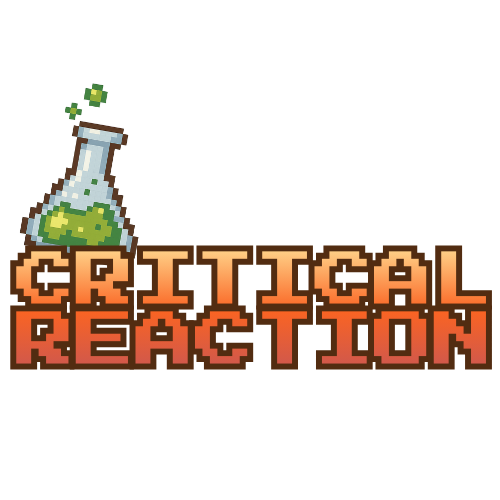

# Critical Reaction



## Introduction

**Critical Reaction** is a 1–4 player, top-down pixel-art co-op game where you work as lab technicians racing the clock to complete semi-realistic chemical workflows. Instead of fighting enemies, players juggle stations, timers, and shared resources to produce enough of a target compound (like benzoic acid) before the delivery deadline.

Think Overcooked, but instead of cooking you're running a chemistry lab.

---

## MVP (Minimum Viable Product)

For this capstone, the **MVP** is defined as:

- [x] Being able to **start the game**.
- [x] Being able to **load a level/map and spawn player characters**.
- [ ] Being able to **receive an order**.
- [ ] Being able to **fill an order** and have the game recognize completion.

If all four of these are working end-to-end, the core loop of Critical Reaction is considered minimally complete.

---

## Project Status

- **Status:** Early Prototype / Pre-Alpha
- **MVP Progress:** 2 of 4 milestones complete

Core systems work: movement, item carrying, storage racks, and the Scale workstation. Networking uses Unity Netcode with server-authoritative sync. Order/delivery system is next.

---

## What's Working

### Player Systems
- WASD/controller movement with networked animations
- Carry one item at a time
- Context-based interaction prompts
- Rebindable controls in Options

### Workstations
- **Scale** - Tare, unit switching, physics-based particles in beakers. Drag scoops around and shake to dump. This one took forever to get right.
- **Storage Rack** - 9 slots, networked, pick up and drop off items

### Networking & Co-op
- Local co-op for 1–4 players
- Server-authoritative sync via Unity Netcode
- Lobby with join/ready flow

### UI & Menus
- Main menu with Options and Credits
- Workstation/storage interaction menus
- Control rebinding

## Planned Features

- **Order/Delivery System** - Receive and complete production orders
- **Campaign Progression** - 8-level Benzoic Acid campaign
- **Additional Stations** - Distillation, cooling bath, wash/separation
- **Timer System** - Global and per-step timers
- **Scoring/Ranking** - Bronze/Silver/Gold completion ranks
- **Tutorial System** - Guided introduction to mechanics

Stretch goals:
- Difficulty modes
- Cosmetic unlocks (lab coats, goggles, décor)

---

## Technologies

- **Engine:** [Unity](https://unity.com/) (2D)
- **Language:** C#
- **Networking:** Unity Netcode for GameObjects
- **Target Platforms:**
  - Windows, Linux, Mac PC (Primary)
  - Console support is possible in future
- **Version Control:** Git
- **Project Management:** Jira


---

## Project Structure

Current Unity project layout:

```text
CriticalReaction/
  Assets/
    Art/                 # Sprites and environment assets
    Prefabs/
      Player.prefab      # Player character with all components
      Items/             # LabItem scriptable objects
      Recipes/           # Recipe scriptable objects
      ChemicalParticles/ # Particle data and prefabs
    Scenes/
      Main Menu.unity    # Title screen
      CoopGame.unity     # Main gameplay scene
    Scripts/
      Gameplay/
        Player/          # PlayerController, PlayerCarry, PlayerInteractor
        Items/           # LabItem, Recipe definitions
        Workstations/
          Workstation/   # Base workstation framework
          Scale/         # Measurement station with particle physics
          Burner/        # Heating station
          StorageRack/   # Item storage system
        Interactions/    # InteractionMenus coordinator
        Coop/            # CoopGameManager
      UX/
        Options/         # InputSettings, RebindEditor
        CoopMenu/        # CoopFlow, CoopConnectMenu, LobbyManager
        MainMenu/        # Title screen logic
        Campaign/        # Campaign progression
        Net/             # Network relay and bootstrap
  ProjectSettings/
  Packages/
  README
```

---

## Installation (End User)

Once builds are available:

1. **Download the build** from the releases page.

2. **Extract** the zip wherever you want.

3. **Run** `CriticalReaction.exe`.

4. **Basic usage**
   - From the main menu, choose **Start Campaign**.
   - On the player setup screen, have each player join (keyboard or controller).
   - Play through the Benzoic Acid campaign levels in order.

5. **Controls (rebindable via Options menu)**
   - Keyboard: `WASD` to move, `E` to interact with workstations/storage, `Esc` to pause.
   - Controller support available.

No Unity install needed to play.

---

## Development Setup

### Prerequisites

- **Unity** (2022.x LTS via Unity Hub)
- **Git**
- **IDE** - Visual Studio, Rider, or VS Code

### Getting the Project

```bash
# Clone the repository
git clone https://github.com/sagefhopkins/critical_reaction.git
cd critical-reaction
```

### Opening in Unity

1. Open **Unity Hub**.
2. Click **Add project** and select the `critical-reaction` folder.
3. Open the project with the correct Unity version.

### First Build / Play

1. In Unity, open the main menu scene, for example:  
   `Assets/Scenes/Menus/MainMenu.unity`
2. Press **Play** in the Unity editor:
   - Verify that:
     - The game loads.
     - The main menu appears.
     - You can enter the player setup, campaign map, and load at least one level.
3. To create a standalone build:
   - Go to **File → Build Settings…**
   - Add the relevant scenes (Main Menu, Player Setup, Campaign Map, at least one Level).
   - Choose **PC, Mac & Linux Standalone** → **Build**.
   - Select an output folder and wait for the build to complete.

---

## Roadmap

### Phase 1 – MVP / Core Loop

- [x] Main menu → player setup flow.
- [x] Implement player spawn & local co-op join/ready logic.
- [x] Implement player movement and interaction system.
- [x] Implement item carry system.
- [x] Implement input rebinding.
- [x] Implement basic stations:
  - [x] Scale (Measurement Bench with particle physics)
  - [ ] Burner (Heating/Mixing station)
  - [x] Storage Rack
  - [ ] Delivery Zone
- [ ] End-to-end order flow:
  - [ ] Receive order
  - [ ] Produce product
  - [ ] Deliver required quantity
  - [ ] Trigger win/lose states

### Phase 2 – Benzoic Acid Campaign

- [ ] Implement all 8 campaign levels (see outline below).
- [ ] Add time limits and quantity requirements per level.
- [ ] Add basic scoring / rank system (Bronze/Silver/Gold).
- [ ] Add tutorial hints and level briefings.

### Phase 3 – Additional Stations

- [ ] Distillation rig
- [ ] Cooling bath
- [ ] Wash/separation station
- [ ] Sink

### Phase 4 – Polish & Extras

- [ ] Improve pixel art (characters, lab equipment, backgrounds).
- [ ] Add sound effects and simple music loops.
- [ ] Add simple cosmetic unlocks (lab coats, goggles, décor).

### Phase 5 – Stretch Goals

- [ ] Difficulty settings (casual / normal / strict).
- [ ] Extended campaigns with other products.
- [ ] Online co-op support.

---

## Benzoic Acid Campaign Outline

Campaign 1 walks the player through a simplified, game-friendly workflow for producing benzoic acid. Each level’s win condition is:  

1. **Level 1 – Standard Solution Setup**
   - **Goal:** Prepare a sodium hydroxide standard solution used later for neutralization/titration steps.
   - **Focus:** Accurate liquid measurement, labeling, and a basic “strength check” at a titration bench.

2. **Level 2 – Prep Ingredients and Glassware**
   - **Goal:** Gather and stage all required reagents; measure out reactants; prepare reaction glassware for the oxidation run.
   - **Focus:** Mise en place, correct measuring, and setting up the proper reaction apparatus.

3. **Level 3 – Reaction Mix Assembly**
   - **Goal:** Assemble the reaction mixture that will ultimately yield benzoic acid.
   - **Reagents:** Toluene, potassium permanganate (plus the required solvent system).
   - **Focus:** Combining reagents in the correct order and ratio; avoiding incorrect sequencing that reduces yield or creates side issues.

4. **Level 4 – Heat and Hold**
   - **Goal:** Run the reaction within a safe temperature band for a required hold time.
   - **Actions:** Heat and stir; monitor temperature; prevent bubbling/boil-over; add concentrated sulfuric acid at the correct time.
   - **Focus:** Hot plate control, cooling bath use, timed addition, and stability under heat.

5. **Level 4.1 – Vacuum Distillation**
   - **Goal:** Distill the reaction mixture under reduced pressure and collect the fraction at the target temperature range.
   - **Focus:** Running a vacuum distillation setup, making the correct collection cut, and avoiding overheating or collecting outside spec.

6. **Level 5 – Wash and Separate**
   - **Goal:** Purify via liquid–liquid separation and retain the correct phase for the next step.
   - **Equipment/Reagents:** Separatory funnel; diethyl ether and product fraction from distillation; concentrated sodium hydroxide solution.
   - **Actions:** Add concentrated NaOH to convert benzoic acid to sodium benzoate; shake and vent frequently (pressure builds); repeat extraction cycle **3×**; identify layers by density; **discard organic layer and keep aqueous layer** (contains sodium benzoate).
   - **Focus:** Layer identification, safe venting technique, repeatable wash cycles, and collecting the “good” phase.

7. **Level 6 – Convert Back to Benzoic Acid**
   - **Goal:** Convert sodium benzoate back into benzoic acid and drive precipitation.
   - **Reagent:** HCl.
   - **Actions:** Slowly add HCl while monitoring pH until **pH < 2**; observe solids (“crashing out”) as benzoic acid forms.
   - **Focus:** Controlled addition, pH monitoring, and timing the endpoint for maximum recovery.

8. **Level 7 – Vacuum Filtration**
   - **Goal:** Isolate the precipitated benzoic acid solids and wash away residual salts/acid.
   - **Actions:** Vacuum filter; wash solids with water; collect wet cake.
   - **Focus:** Proper filtration setup, minimizing product loss, and clean washing technique.

9. **Level 8 – Recrystallization**
   - **Goal:** Improve purity by dissolving and re-forming crystals under controlled conditions.
   - **Solvent System:** Water/ethanol mixture that does not fully dissolve the solids at room temperature.
   - **Actions:** Heat until all solids dissolve; cool slowly to room temperature to grow crystals; then chill (e.g., ice bath) to complete crystallization; filter again to collect purified crystals.
   - **Focus:** Solvent choice, controlled cooling for crystal growth, and purification through re-filtration.

10. **Level 9 – Drying Oven**
   - **Goal:** Dry crystals to a target mass and dryness spec.
   - **Actions:** Dry product in a low-temperature drying oven until stable mass is achieved.
   - **Focus:** Avoiding overheating, meeting dryness requirements, and hitting the final yield target.

11. **Level 10 – Critical Run: Full Batch**
   - **Goal:** Run a streamlined version of the full process under one master timer and deliver the final required amount of benzoic acid.
   - **Focus:** Station-to-station coordination, parallel tasking, timing dependencies (reaction hold, distillation cut, separation cycles, crystallization/drying), and meeting final order quantity.

---

## Known Issues

- Art and animations are placeholder
- Only CoopGame scene works right now, no campaign levels yet
- No order/delivery or timer system yet
- Scale is the only fully functional workstation

---

## Support

Open an issue if something's broken or you have ideas.

---

## Contributors

- **Sage Hopkins** – Lead Developer
- **Tia Moss** – Programming & Systems
- **Noah Hopkins** - Chemist
